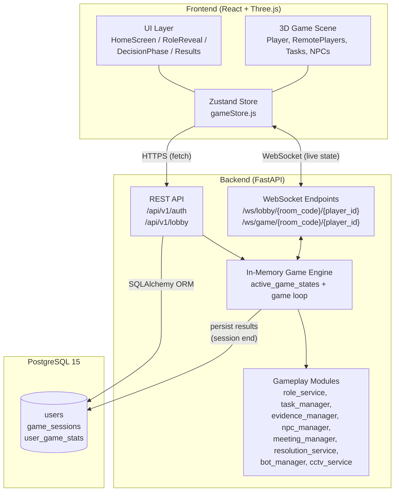
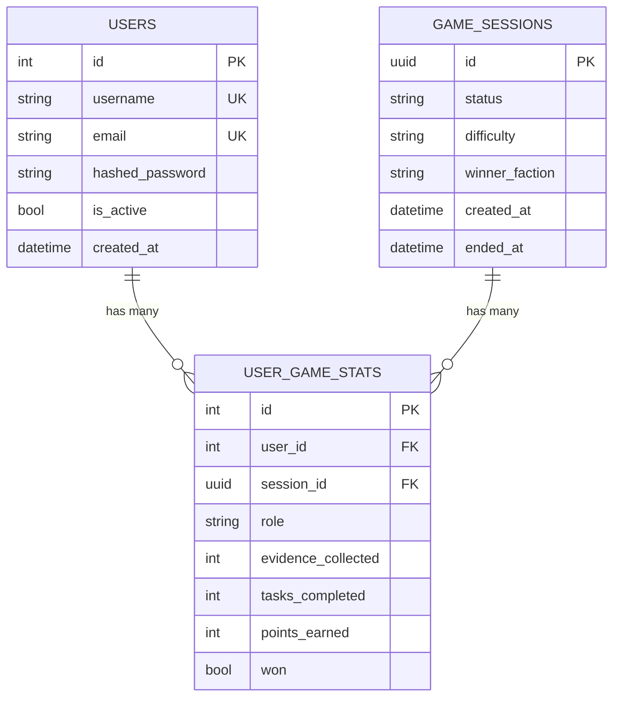
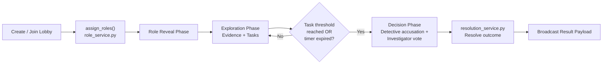

# Campus Undercover: The Christ Mystery

A multiplayer social deduction and investigation game set on a 3D campus. Players are assigned secret roles and must gather evidence, complete tasks, and identify the hidden threat before time runs out.

---

## Table of Contents

1. [Project Overview](#1-project-overview)
2. [Tech Stack](#2-tech-stack)
3. [System Architecture](#3-system-architecture)
4. [Frontend Structure](#4-frontend-structure)
5. [Backend Structure](#5-backend-structure)
6. [Database Structure](#6-database-structure)
7. [Game Logic](#7-game-logic)
8. [Setup & Installation](#8-setup--installation)
9. [Contributors & Contributions](#9-contributors--contributions)
10. [Folder Structure](#10-folder-structure)

---

## 1. Project Overview

Campus Undercover: The Christ Mystery is a multiplayer social deduction and investigation game built as a 3D campus-themed browser experience. Players are assigned secret roles and must investigate evidence, complete tasks, and identify the hidden threat before time runs out.

The game follows a deduction loop similar to hidden-role games:

- One player is the **Detective**
- One or more players are **Investigators**
- One player is the **Mastermind**
- One player is the **Conspirator**
- The goal is to expose the villain team through evidence gathering, voting, and accusation logic

The project combines a React + Three.js frontend with a FastAPI backend and WebSocket-based multiplayer architecture. It includes lobby creation, role assignment, custom game loops, task progression, bot players, investigations, and end-of-match resolution.

---

## 2. Tech Stack

### Frontend

| Category | Technology |
| --- | --- |
| Framework | React 18 |
| Build tool | Vite |
| Language | JavaScript / JSX |
| 3D rendering | @react-three/fiber, @react-three/drei, three.js |
| State management | Zustand |
| Icons | Lucide React |
| Real-time updates | WebSockets |

### Backend

| Category | Technology |
| --- | --- |
| Language | Python 3 |
| Framework | FastAPI |
| ORM | SQLAlchemy 2 |
| Validation | Pydantic, Pydantic Settings |
| Auth | Python-Jose (JWT), Python-Multipart |
| DB driver | psycopg2-binary |
| Migrations | Alembic |
| Server | Uvicorn |

### Database / Infrastructure

- PostgreSQL 15
- Docker / Docker Compose
- Alembic migrations
- JWT-based authentication
- WebSocket channels for lobby and in-game state

---

## 3. System Architecture

The repository is split into two runtime components: a **frontend application** (`frontend/`) and a **backend API/game server** (`backend/`).

- The frontend renders the 3D campus, player avatars, UI panels, and the lobby/authentication flow.
- The backend exposes REST endpoints for authentication and lobby management.
- Real-time gameplay (movement, tasks, chat, meetings, evidence, resolution) is delivered over WebSocket channels.
- PostgreSQL stores persistent user accounts and match outcome statistics.
- Active room/game state lives in memory on the backend during a match, while the database holds persistent records for users and session results.



**Layer summary**

- `frontend` — presentation layer and client-side game loop
- `backend/app/main.py` — central server: room lifecycle, game loop, WebSocket broadcasting, session orchestration
- `backend/app/game/*` — gameplay logic modules for tasks, evidence, roles, NPC behavior, abilities, meetings, and resolution
- `backend/app/db/*` — data models, database session setup, and migration metadata

---

## 4. Frontend Structure

The frontend is organized under `frontend/src/`.

### Main directories

- `src/components/game/` — 3D world, player movement, tasks, remote players, evidence, NPCs
- `src/components/ui/` — HUD, lobby, screens, overlays, task panels, results panels, decision screens
- `src/store/` — Zustand store for app state and live game state
- `src/utils/` — helper modules such as audio and evidence visuals
- `src/config/` — configuration-related frontend files

### Key frontend files

| File | Responsibility |
| --- | --- |
| `src/App.jsx` | App root, socket lifecycle, onboarding flow, solo/offline setup, game bootstrap |
| `src/main.jsx` | React entry point |
| `src/store/gameStore.js` | Central state for game phase, player data, evidence, chat, task state, results |
| `src/components/game/GameScene.jsx` | Main 3D scene, world composition, overlays, HUD integration |
| `src/components/game/Player.jsx` | Local player avatar and movement behavior |
| `src/components/game/RemotePlayers.jsx` | Remote player rendering and role badges |
| `src/components/ui/HomeScreen.jsx` | Lobby/auth screen and API helpers |
| `src/components/ui/RoleRevealScreen.jsx` | Role identity reveal screen |
| `src/components/ui/DecisionPhaseScreen.jsx` | Detective/Investigator vote submission screen |
| `src/components/ui/ResultsScreen.jsx` | End-of-game summary, winner reveal, dossier tabs |
| `src/components/ui/TaskMinigame.jsx` | Task interaction mini-game logic |
| `src/components/ui/ChatPanel.jsx` | In-game chat UI |

### State management

`src/store/gameStore.js` (Zustand) holds:

- Current screen
- Player identity and role
- Room code and WebSocket connection
- Other players
- Tasks and task progress
- Evidence and dossier state
- Game phase and result payload
- Chat and meeting status

This store is the primary source of truth for gameplay and UI transitions.

---

## 5. Backend Structure

The backend is organized under `backend/app/`.

### Core backend areas

- `app/api/v1/` — REST API routers for auth and lobby endpoints
- `app/core/` — settings and JWT/security helpers
- `app/db/` — database models and SQLAlchemy setup
- `app/game/` — gameplay engine modules for roles, tasks, evidence, NPCs, meetings, resolution
- `app/main.py` — FastAPI app entry point, room lifecycle, WebSocket endpoints, game loop

### API routes

**Authentication**

- `POST /api/v1/auth/register`
- `POST /api/v1/auth/login`
- `POST /api/v1/auth/login/oauth`
- `GET /api/v1/auth/me`

**Lobby**

- `POST /api/v1/lobby/create`
- `POST /api/v1/lobby/join`
- `GET /api/v1/lobby/rooms`
- `GET /api/v1/lobby/room/{room_code}`
- `POST /api/v1/lobby/leave/{room_code}`

**WebSocket**

- `/ws/lobby/{room_code}/{player_id}`
- `/ws/game/{room_code}/{player_id}`

### Server logic

`backend/app/main.py` handles core match orchestration:

- Room creation and lifecycle
- Player join / lobby handling
- Role assignment generation
- Task assignment and progress tracking
- Bot movement and bot chat logic
- Evidence collection and event broadcasting
- Meeting timing and decision phase control
- Final game resolution and winner calculation

It maintains a central in-memory game state per room (`active_game_states`) alongside a periodic game loop.

---

## 6. Database Structure

The project uses PostgreSQL with SQLAlchemy ORM and Alembic migrations.

### Entity-Relationship Diagram



### Table details

**`users`**

- `id` — integer primary key
- `username` — unique username
- `email` — unique email address
- `hashed_password` — password hash
- `is_active` — active/inactive flag
- `created_at` — timestamp

Stores authentication and account data.

**`game_sessions`**

- `id` — UUID primary key
- `status` — `waiting` / `playing` / `finished`
- `difficulty` — standard (current game rules are fixed to a standard ruleset)
- `winner_faction` — `INVESTIGATORS` or `VILLAINS`
- `created_at` — creation timestamp
- `ended_at` — end timestamp

**`user_game_stats`**

- `id` — integer primary key
- `user_id` — FK to `users.id`
- `session_id` — FK to `game_sessions.id`
- `role` — `DETECTIVE` / `INVESTIGATOR` / `MASTERMIND` / `CONSPIRATOR`
- `evidence_collected`
- `tasks_completed`
- `points_earned`
- `won`

**Relationships**

- `User` → `UserGameStats`: one-to-many
- `GameSession` → `UserGameStats`: one-to-many

### Migration notes

Alembic files live under `backend/alembic/`, including the initial migration `backend/alembic/versions/b9a2f4653155_initial_schema.py`.

The persistence model combines:

- Database storage for users and session records
- In-memory server state for active game runtime
- Real-time WebSocket payloads for live gameplay state

---

## 7. Game Logic

### Core game loop



1. A player creates a lobby or joins a waiting room.
2. The backend assigns roles using `assign_roles()` in `role_service.py`.
3. The game transitions to the role reveal phase.
4. Players explore a 3D campus map, investigate evidence, and complete tasks.
5. Once the task threshold is reached, or the timer ends, the decision phase is triggered.
6. The Detective submits a suspect accusation and Investigators submit a majority vote.
7. The backend resolves the round and broadcasts the result payload.

### Roles

`role_service.py` supports player counts from 1 to 6, assigning:

- `DETECTIVE`
- `INVESTIGATOR`
- `MASTERMIND`
- `CONSPIRATOR`

The project currently follows a fixed standard ruleset with a 5-minute round; the code explicitly preserves this standard configuration rather than supporting multiple difficulty modes.

### Win conditions

`backend/app/game/resolution_service.py` determines the winner by evaluating:

- The Detective's accusation against the actual Mastermind
- The Investigators' majority vote against the actual Conspirator
- Overall faction outcome: `INVESTIGATORS` or `VILLAINS`

If both accusations are correct, the Investigators win. Otherwise, the Villains win. A timeout-based Villain victory also applies if the countdown expires before tasks are complete.

### Gameplay systems

| Module | Responsibility |
| --- | --- |
| `task_manager.py` | Task assignment, completion, scoring, room progress |
| `evidence_manager.py` | Evidence collection and distribution |
| `npc_manager.py` | NPC behavior and observation logic |
| `ability_manager.py` | Role-specific actions and abilities |
| `meeting_manager.py` | Phase-based discussion and meeting timing |
| `cctv_service.py` | Surveillance and clue generation |
| `correlation_engine.py` | Evidence linking and deduction support |
| `suspect_dossier_service.py` | Detective dossier generation |
| `bot_manager.py` / `bot_chat_service.py` | Autonomous bot behavior and bot messages |

### Frontend gameplay flow

The React client renders:

- A campus map in 3D
- Player movement and interactions
- UI to accept evidence and tasks
- A meeting screen
- Accusation and decision phases
- A results screen with reveal cards and vote summary

---

## 8. Setup & Installation

### Prerequisites

- Node.js 18+
- Python 3.10+
- Docker + Docker Compose (recommended for PostgreSQL)
- Git

### 1. Clone the repository

```bash
git clone https://github.com/campusundercover/campusgame.git
cd campusgame
```

### 2. Backend setup

```bash
cd backend
python -m venv .venv
source .venv/bin/activate   # Linux/macOS
# .venv\Scripts\activate    # Windows
pip install -r requirements.txt
```

### 3. Database setup

The repository includes a PostgreSQL service in `docker-compose.yml`.

```bash
cd ..
docker compose up -d db
```

This starts PostgreSQL on port `5432` using the default config in the compose file.

### 4. Run backend

From the `backend` directory:

```bash
uvicorn app.main:app --host 0.0.0.0 --port 8000 --reload
```

Or, to run the full stack with Docker Compose:

```bash
docker compose up --build
```

### 5. Frontend setup

From the project root:

```bash
cd frontend
npm install
npm run dev -- --host 0.0.0.0
```

Then open the app in the browser, typically at:

```text
http://localhost:5173
```

### 6. Environment notes

Default settings live in `backend/app/core/config.py`:

- `DATABASE_URL` defaults to Postgres on `localhost:5432`
- Backend CORS allows local frontend origins

Override values using environment variables or a `.env` file in the backend directory as needed.

---

## 9. Contributors & Contributions

Based on the repository's `git log` history, the project has three contributors on record.

| Contributor | Focus Area | Contribution Summary |
| --- | --- | --- |
| `sudeeepaa` | Backend & game logic | Backend game logic, lobby/session management, task and evidence systems, role reveal flow, WebSocket stability, single-player mode, decision-phase resolution, and real-time game-state fixes. Notable commits: "Task Assignment System + Evidence & Detective System", "Dynamic Voter Status, Immediate Resolution", "decision screen real time fix". |
| `AkashdeepDey` | Frontend & multiplayer infrastructure | Frontend fixes, layout responsiveness, landing page work, multiplayer room and movement sync, timer bug fixes, and stable game launch flows. Notable commits: "Frontend fix v5", "Fix Multiplayer room issue", "resolve multiplayer player movement sync across devices", "feat: complete social deduction game implementation with responsive UI". |
| `snehavvv` | UI & gameplay mechanics | Major game UI screens and interactive mechanics: results screen, decision phase, loading screen, task minigame, task assignment logic, CCTV-related systems, and gameplay flow improvements. Notable commits: "Result Screen", "Decision phase", "TaskMinigame variants", "tasks assigning according to the role". |

No additional active contributors appear in the commit history at the time of this review.

---

## 10. Folder Structure

```text
campusgame/
├── backend/
│   ├── alembic/
│   │   ├── README
│   │   ├── env.py
│   │   └── versions/
│   │       └── b9a2f4653155_initial_schema.py
│   ├── app/
│   │   ├── api/
│   │   │   └── v1/
│   │   │       ├── api.py
│   │   │       └── endpoints/
│   │   │           ├── auth.py
│   │   │           └── lobby.py
│   │   ├── core/
│   │   │   ├── config.py
│   │   │   └── security.py
│   │   ├── db/
│   │   │   ├── base.py
│   │   │   ├── base_class.py
│   │   │   ├── session.py
│   │   │   └── models/
│   │   │       ├── game.py
│   │   │       └── user.py
│   │   ├── game/
│   │   │   ├── ability_manager.py
│   │   │   ├── bot_chat_service.py
│   │   │   ├── bot_manager.py
│   │   │   ├── cctv_service.py
│   │   │   ├── correlation_engine.py
│   │   │   ├── evidence_manager.py
│   │   │   ├── investigation_service.py
│   │   │   ├── lobby_manager.py
│   │   │   ├── meeting_manager.py
│   │   │   ├── npc_manager.py
│   │   │   ├── resolution_service.py
│   │   │   ├── role_service.py
│   │   │   ├── suspect_dossier_service.py
│   │   │   └── task_manager.py
│   │   ├── schemas/
│   │   │   ├── game.py
│   │   │   ├── lobby.py
│   │   │   └── user.py
│   │   ├── tests/
│   │   └── main.py
│   ├── Dockerfile
│   ├── requirements.txt
│   └── alembic.ini
│
├── frontend/
│   ├── public/
│   ├── src/
│   │   ├── components/
│   │   │   ├── game/
│   │   │   └── ui/
│   │   ├── config/
│   │   ├── store/
│   │   │   └── gameStore.js
│   │   ├── utils/
│   │   ├── App.jsx
│   │   ├── index.css
│   │   ├── main.jsx
│   │   └── ...
│   ├── Dockerfile
│   ├── index.html
│   ├── package.json
│   ├── package-lock.json
│   ├── vite.config.js
│   └── ...
│
├── docker-compose.yml
├── .gitignore
└── README.md
```

---

## Summary

Campus Undercover: The Christ Mystery is a full-stack social deduction game combining 3D campus exploration, hidden-role gameplay, evidence-based investigation, and real-time multiplayer interaction. The codebase is organized around a React frontend, a FastAPI backend, PostgreSQL persistence, and an in-memory server game engine for live room orchestration.

The project is designed as a browser-based deduction game featuring role-based hidden information, task completion, bot agents, and a clear end-of-match resolution cycle.