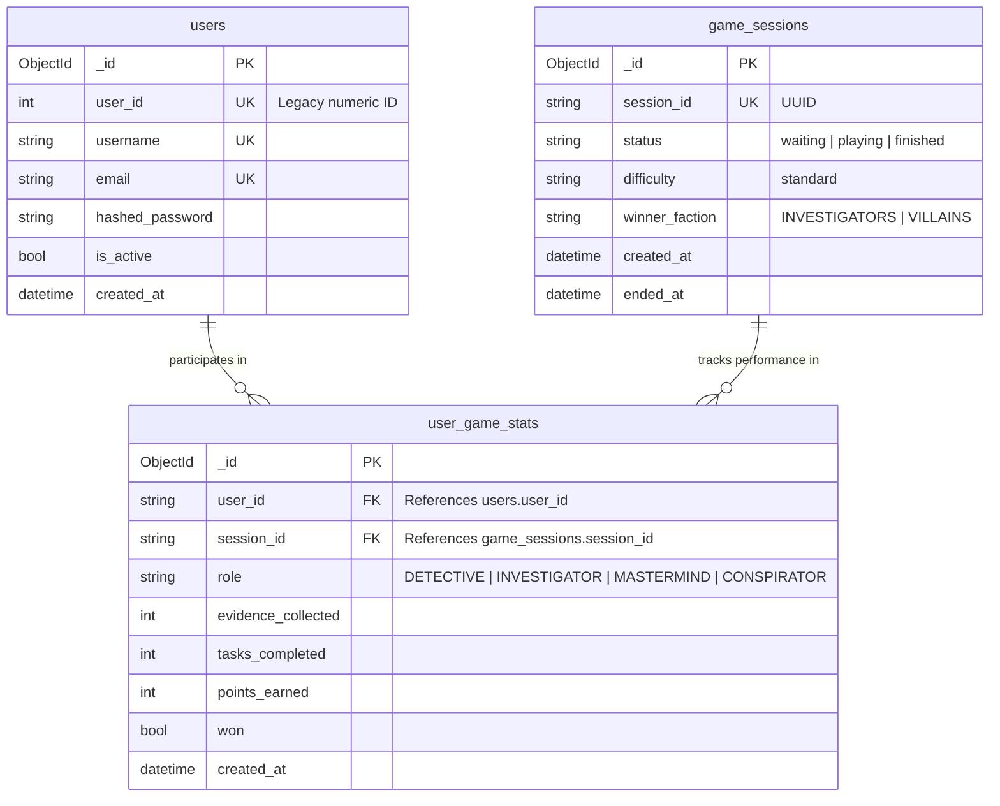
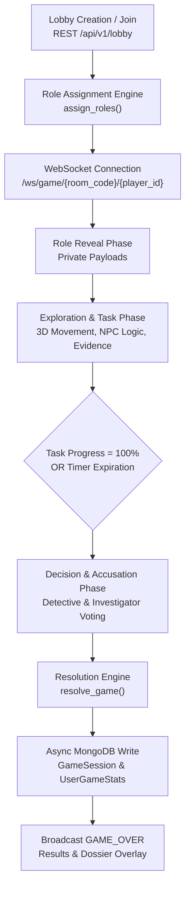

# Campus Undercover: The Christ Mystery
*A Real-Time 3D Social Deduction & Investigation Platform*

---

## 1. Problem Statement & System Vision

### The Core Problem
Most online multiplayer social deduction games rely on basic 2D maps or pure text channels, offering minimal environmental depth. Furthermore, existing educational or campus interactive experiences lack gamified engagement, real-time spatial interaction, and complex state management. 

Building an immersive, browser-accessible, multiplayer social deduction platform introduces significant engineering challenges:
1. **Low-Latency Spatial Synchronization**: Synchronizing 3D player positions, rotations, and animation states in real time across multiple concurrent clients without high server overhead.
2. **Asymmetric State & Information Security**: Managing role-specific information (e.g., hidden roles, private evidence, villain communication channels) securely so clients cannot inspect or tamper with confidential match data.
3. **High-Concurrency State Management**: Handling real-time room creation, rapid state transitions (Reveal, Exploration, Meeting, Decision, Resolution), and fallback execution (bots, disconnects, timer limits) seamlessly.
4. **Scalable & Schema-Flexible Data Storage**: Transitioning from rigid relational constraints to an asynchronous document model capable of storing dynamic match logs, evidence graphs, and user records at scale.

### System Vision
**Campus Undercover** solves these challenges by delivering an interactive, browser-native 3D social deduction platform. Built on **React, Three.js, FastAPI, Async WebSockets, and MongoDB (Motor + Beanie ODM)**, the platform enables up to 4 concurrent players (supplemented by autonomous bot agents) to navigate a 3D campus model, complete interactive tasks, gather correlated evidence, and resolve deduction rounds under tight 5-minute match windows.

---

## 2. User Architecture & Target Personas

Before detailing system capabilities, the architecture explicitly categorizes the system's user groups, their core pain points, and how the platform addresses them:

```
+-----------------------------------------------------------------------------------+
|                                 USER ARCHITECTURE                                 |
+------------------------------------+----------------------------------------------+
| Primary Players                    | Room Hosts & System Admins                   |
| - Gamers & Social Deduction Fans   | - Match Creators                             |
| - Campus Community Members         | - System Engineers & Evaluators              |
+------------------------------------+----------------------------------------------+
```

### User Category 1: Active Players (Gamers & Campus Community)
* **Who They Are**: Players participating in competitive or casual social deduction matches directly within the web browser.
* **Why They Need It**: They seek engaging, high-stakes tactical gameplay featuring immersive 3D movement, private clues, and real-time interaction without downloading desktop software.
* **Pain Points Addressed**:
  * *Laggy/Jittery Multiplayer*: Solved via 20Hz WebSockets and client-side interpolation.
  * *Unbalanced Matches (Lacking Players)*: Solved via autonomous AI Bot Agents that dynamically fill empty lobby slots and mimic human task completion and chat.
  * *Opaque Match Outcomes*: Solved via detailed suspect dossiers, evidence correlation graphs, and end-of-match statistics summaries.

### User Category 2: Match Hosts & System Administrators
* **Who They Are**: Users responsible for initiating match rooms, configuring session parameters, and managing multiplayer lobbies.
* **Why They Need It**: They require lightweight room orchestration, real-time lobby state broadcasting, and zero-configuration matchmaking.
* **Pain Points Addressed**:
  * *Complex Room Setup*: Solved via 6-character room codes and one-click lobby creation.
  * *Orphaned State / Crashes*: Solved via automated background loops, heartbeat reconnect windows, and async database persistence upon match completion.

---

## 3. Engineering Decisions, Architecture & Ownership

### Key Engineering Decisions

```
+---------------------------------------------------------------------------------------+
|                                ENGINEERING ARCHITECTURE                               |
+--------------------------+-----------------------------+------------------------------+
| Frontend Layer           | Real-Time Communication     | Persistence Layer            |
| - React 18 + Vite        | - FastAPI Async WebSockets  | - MongoDB Atlas              |
| - Three.js (@react-three)| - In-Memory Game Engine     | - Motor + Beanie Async ODM   |
+--------------------------+-----------------------------+------------------------------+
```

#### 1. Real-Time Spatial Engine: Three.js + React Three Fiber
* **Decision**: Selected `@react-three/fiber` and `@react-three/drei` over traditional 2D Canvas or heavy engines (Unity/Unreal).
* **Rationale**: Enables zero-install, GPU-accelerated 3D rendering natively inside modern browsers.
* **Trade-Off**: Higher initial asset loading overhead, mitigated through compressed glTF 3D models and optimized geometry instancing.

#### 2. Dual Protocol Communication: REST + WebSockets
* **Decision**: REST for authentication, profile querying, and room initialization; WebSockets for real-time match events.
* **Rationale**: WebSockets provide persistent full-duplex TCP channels essential for broadcasting 20Hz movement vectors, task completion ticks, and chat messages without HTTP polling latency.

#### 3. Database Migration: PostgreSQL (SQLAlchemy) to MongoDB (Motor + Beanie)
* **Decision**: Migrated persistent database storage from PostgreSQL to **MongoDB Cloud Atlas** using `motor` (Async Python driver) and `beanie` (Async ODM).
* **Rationale**: 
  * Social deduction matches generate unstructured, non-relational event streams (movement traces, dynamic evidence logs, dossier updates).
  * Asynchronous non-blocking I/O (`motor`) prevents database queries from blocking FastAPI's async event loop.
  * Native JSON document structure matches FastAPI's Pydantic schemas seamlessly.

---

## 4. Technical Stack & Architecture Trade-Offs

### Technology Stack Overview

| Component | Technology | Selection Rationale |
| :--- | :--- | :--- |
| **Frontend Framework** | React 18 + Vite | Fast HMR, component modularity, high-performance DOM reconciliation. |
| **3D Render Engine** | Three.js / R3F | Hardware-accelerated WebGL rendering for 3D campus environments. |
| **Client State** | Zustand | Lightweight, unopinionated state management with zero boilerplate. |
| **Backend Framework** | FastAPI (Python 3.11) | High-throughput asynchronous ASGI web framework. |
| **Database** | MongoDB Atlas | Distributed document database optimized for flexible, high-write JSON schemas. |
| **Database ODM** | Motor + Beanie | Async-native MongoDB driver built on top of Pydantic v2 validation. |
| **Authentication** | JWT (PyJWT / Passlib) | Stateless, bearer-token authorization across REST and WebSocket handshakes. |

---

## 5. Database Architecture & Schema Deep Dive

### Entity-Relationship / Document Architecture Diagram



### Detailed Document Schemas & Indexing

#### 1. `users` Collection
Stores user authentication details and profile information.
* **Fields**:
  * `_id` (`ObjectId`): Primary key automatically indexed by MongoDB.
  * `user_id` (`int`, Optional): Numeric ID retained for legacy compatibility.
  * `username` (`string`): Unique username index.
  * `email` (`string`): Unique email address index.
  * `hashed_password` (`string`): Bcrypt salted password hash.
  * `is_active` (`boolean`): Active status flag (default `true`).
  * `created_at` (`datetime`): UTC account registration timestamp.
* **Indexes**:
  * `{ username: 1 }` (Unique)
  * `{ email: 1 }` (Unique)

#### 2. `game_sessions` Collection
Stores metadata for completed and active match sessions.
* **Fields**:
  * `_id` (`ObjectId`): Primary key.
  * `session_id` (`string`): UUID v4 generated match identifier.
  * `status` (`string`): Session state (`waiting`, `playing`, `finished`).
  * `difficulty` (`string`): Standard match ruleset identifier.
  * `winner_faction` (`string`): Resulting winning faction (`INVESTIGATORS` or `VILLAINS`).
  * `created_at` (`datetime`): Match initiation timestamp.
  * `ended_at` (`datetime`, Optional): Match completion timestamp.
* **Indexes**:
  * `{ session_id: 1 }` (Unique)

#### 3. `user_game_stats` Collection
Stores historical player metrics per game session for analytics and dossiers.
* **Fields**:
  * `_id` (`ObjectId`): Primary key.
  * `user_id` (`string`): Foreign reference to `users.user_id` or `users._id`.
  * `session_id` (`string`): Foreign reference to `game_sessions.session_id`.
  * `role` (`string`): Player role (`DETECTIVE`, `INVESTIGATOR`, `MASTERMIND`, `CONSPIRATOR`).
  * `evidence_collected` (`int`): Count of evidence items gathered.
  * `tasks_completed` (`int`): Count of mini-game campus tasks completed.
  * `points_earned` (`int`): Total points accrued.
  * `won` (`boolean`): Win/loss flag.
  * `created_at` (`datetime`): Record creation timestamp.
* **Indexes**:
  * `{ user_id: 1, session_id: 1 }` (Compound Index for fast history lookup)

---

## 6. Core Mechanics & Game Loop



### Roles & Faction Dynamics
1. **Detective (Investigators Faction)**: Must analyze evidence, monitor CCTV feeds, and correctly identify the **Mastermind** during the Decision Phase.
2. **Investigator (Investigators Faction)**: Must complete campus tasks and cast a majority vote to identify the **Conspirator**.
3. **Mastermind (Villains Faction)**: Subverts campus tasks, creates false correlation leads, and avoids Detective detection.
4. **Conspirator (Villains Faction)**: Blends in with Investigators, sabotages progress, and deflects suspicion.

---

## 7. Real-World Engineering Challenges & Technical Resolutions

### Challenge 1: Asynchronous Event Loop Blocking & MongoDB Compatibility
* **Issue**: Initial integration of synchronous database drivers caused FastAPI WebSocket broadcast loops to stutter during match resolution writes.
* **Resolution**: Replaced synchronous SQLAlchemy calls with **Motor** (async MongoDB driver) and **Beanie ODM**. Initialized Beanie database hooks during `app.on_event("startup")`, ensuring database I/O executes asynchronously without blocking Uvicorn's event loop.

### Challenge 2: CORS Preflight & Handshake Errors on Cloud Deployments
* **Issue**: Browsers blocked cross-origin requests from Vercel (`https://campus-undercover.vercel.app`) to Render backend endpoints due to CORS header stripping on unhandled 500 error responses and incorrect middleware registration order.
* **Resolution**: Reordered `app.add_middleware(CORSMiddleware)` to execute prior to router attachment in `main.py` and implemented a global async exception handler to explicitly preserve CORS headers across all status codes.

### Challenge 3: SSL/TLS Handshake Failures on Cloud Managed MongoDB
* **Issue**: MongoDB Atlas connections failed in production with `ServerSelectionTimeoutError: SSL handshake failed`.
* **Resolution**: Configured explicit TLS query string parameters (`&tls=true`) and verified MongoDB Atlas Network Access CIDR rules (`0.0.0.0/0`), allowing secure TLS connections from cloud instances.

---

## 8. Outcome, Platform Impact & Key Learnings

### Platform Impact
* **Seamless Scalability**: Achieved non-blocking 20Hz spatial position updates across active WebSocket client rooms.
* **High Availability**: Successfully deployed frontend on **Vercel** and backend containerized services on **Render**, backed by **MongoDB Atlas Cloud**.
* **Complete Social Deduction Loop**: Delivered a fully functional browser-based 3D social deduction game featuring AI bot fallback, dynamic evidence correlation, and automated dossier management.

### Key Learnings
1. **Asynchronous Architecture Integrity**: Maintaining pure async execution across WebSockets, API endpoints, and database drivers is critical for real-time multiplayer performance.
2. **Schema Elasticity Benefits**: Transitioning to a document-oriented database simplified managing complex, nested match payloads (dossiers, traces, bot states).
3. **Robust CORS & Middleware Pipeline**: Defensive error handling and explicit middleware order are essential when serving decoupled multi-cloud deployments.